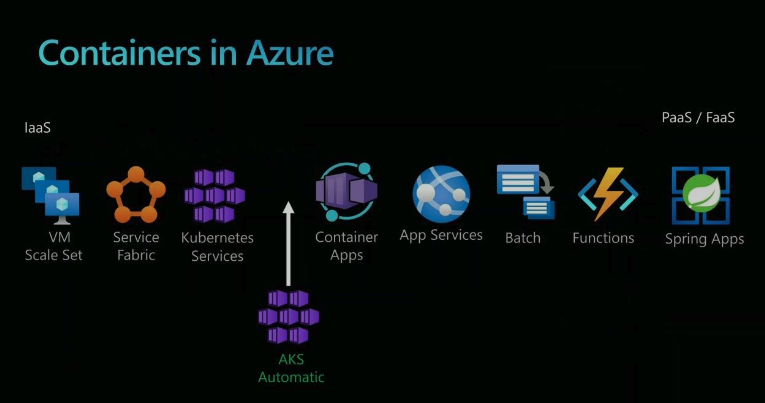
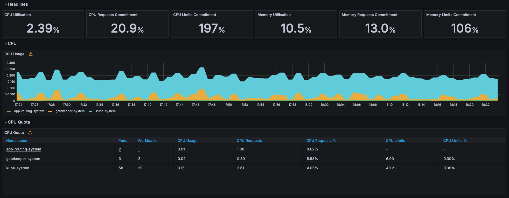

# Introduction

Operating and managing Kubernetes (and even AKS) has gotten very complex. AKS Automatic offers a simplified Kubernetes experience for customers. Automatic manages the cluster configuration, including nodes, scaling, security, updates, and other preconfigured settings.

Automatic clusters are optimized to run most production workloads and provision compute resources based on Kubernetes manifests. The streamlined configuration follows AKS best practices and recommendations for cluster and workload setup, scalability, and security, freeing developers to run cloud native apps without spending too much time on managing clusters.

---

## Sub-Challenge 1: Create an AKS Automatic cluster

### Description

AKS Automatic will manage cluster setup, including node management, scaling, security, and preconfigured settings that follow AKS well-architected recommendations.

- Production ready by default
- Built-in best practices and safeguards
- Code to Kubernetes in minutes

### Success Criteria

- You have provisioned an AKS Automatic Cluster

### Hints

- You might need to install the aks-preview Azure CLI extension and register some feature flags

### Questions

- What did you notice that's different from previous AKS deployments?
- How long did the full deployment take?

---

## Sub-Challenge 2: Validate the AKS Automatic cluster

### Description

Now that our cluster is being created, let's look inside and see how it operates.

### Success Criteria

- You can successfully run `kubectl get nodes` on the cluster

### Hints

- You might need to install kubelogin

### Questions

- How many workloads are deployed into cluster upon creation?
    - What is Eraser? Gatekeeper? VPA? KEDA? Cilium?
- Notice how there's still an "MC_" resource group created. What happens if you try to delete it?
- What policies are automatically created?
- How many nodes are in the cluster? What type?

---

## Sub-Challenge 3: Deploy Sample App to AKS Automatic cluster

We will use the AKS Store Demo as the example application.

### Description

Deploy [aks-store-demo](https://github.com/Azure-Samples/aks-store-demo) to your AKS Automatic cluster

### Success Criteria

- The app is up and running
- You're able to access the `store-front` app through its public IP

### Questions

- How is traffic routed to the `store-front` IP?
- How many nodes are in the cluster now?

---

## Sub-Challenge 4: Networking + Observability

As you've hopefully noticed by now, AKS takes a lot of defaults and bundles them into a single package.  This includes networking both and observability configuration.  This subchallenge is less about making a change, but more about understanding what is available to you.

For example Azure Managed Grafana and Prometheus are auto-installed and configured:

### Success Criteria

- Log into the deployed Azure Managed Grafana instance
- View the `Kubernetes / Compute Resources / Cluster` dashboard
- What other metrics can you see automatically?
- View the Log from `KubeEvents`

### Questions

- What is the CNI?  
- What's your Pod Address range? 
- What's your VNet's Address range?
    - Do they overlap or not? Why?
- What other built-in dashboards are there?

---

## Sub-Challenge 5: Load Test + Scale App

Now let's see how the cluster reacts when we send a bunch of traffic to it.

### Description

Now that you have AKS Automatic installed, let's try to load test the app and see how it scales.  First you need to tell AKS how/when to scale it.

Scale  `order-service` with the following parameters:

- Polling interval: 10
- Cooldown period: 30
- Minimum replicas: 1
- Maximum replicas: 10
- Trigger type: Memory
- Metric type: Utilization
- Value: 120

Deploy an instance of Azure Load Testing and use it to scale the `order-service`  with the following parameters:

- URL: `http://<Public IP>/order`
- Content type: `application/json`
- Method: `POST`
- Body: `{"customerId":"3940867901","items":[{"productId":3,"quantity":3,"price":12.99}]}`

### Success Criteria

- `order-service` scales to multiple instances

### Hints:

- Use KEDA objects to set the scaling parameters.
- To see your scaled objects: `kubectl get scaledobjects.keda.sh`
- To see how your apps are being used: `kubectl top pod`

### Questions

- What does it mean that the memory utilization was set to 120?